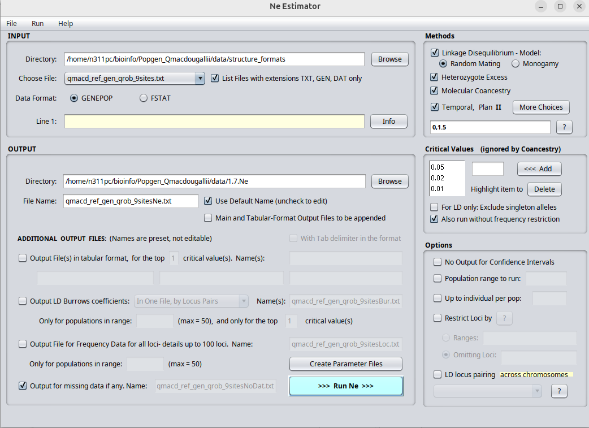

# Estimación del tamaño poblacional efectivo (Ne)

En este apartado se presenta la estimación del tamaño poblacional efectivo (Ne) utilizando el software **NeEstimator**. El análisis se realizó a partir de los datos de SNPs filtrados para las poblaciones de interés.

En la imagen se muestra la interfaz de resultados de NeEstimator, donde se visualizan los valores estimados de Ne para las diferentes poblaciones analizadas, junto con los intervalos de confianza calculados mediante el método de desequilibrio de ligamiento (LD). Estos resultados permiten evaluar la variabilidad genética y el tamaño efectivo de las poblaciones estudiadas.