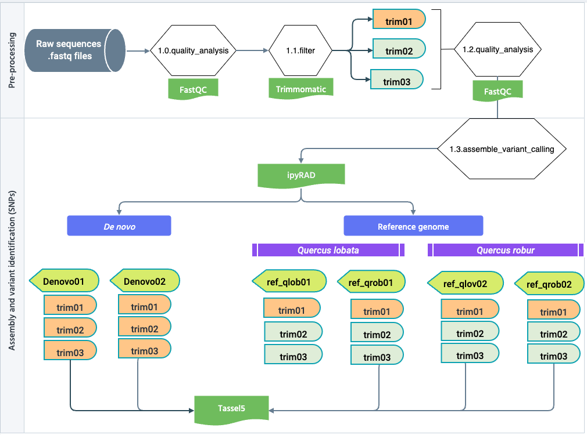

# Ensamble e identificación de las variantes (SNPs) con ipyRAD

---



- Se utilizaron las modalidades _de novo_ y con _genoma de referencia_. 

- Se utilizaron los genomas de _Quercus lobata_ y _Q. robur_.

- Para los ensambles en ipyRAD se hicieron dos ramas (branches).

Los parámetros que se modificaron son:

```python
# 1
("clust_threshold", "0.70")
('pop_assign_file', 'popmap_9sites_2zones_trim01.txt')

# 2
("min_samples_locus", 79)
("clust_threshold", "0.90")
```

- El `clust_threshold` es el nivel de similitud de secuencia; en el que dos secuencias se identifican como homólogas y, por lo tanto, se agrupan. El valor se ingresa como un decimal (por ejemplo, 0.90). Por otro lado, el programa no recomienda utilizar valores superiores a 0,95 ya que es posible que las secuencias homólogas no se agrupen en un umbral tan alto debido a la presencia de N, indeles, errores de secuenciación o polimorfismos.
- El `min_samples_locus` es el número mínimo de muestras que deben tener datos en un locus determinado para que se conserven en el conjunto de datos final. El programa indica que si se ingresa un número igual al número total de muestras en su conjunto de datos, solo devolverá loci que tengan datos compartidos en todas las muestras, mientras que si ingresa un valor más bajo, devolverá una matriz más dispersa, incluidos los loci para los que al menos cuatro muestras contengan datos por ejemplo. Este parámetro se anula si se ingresan valores `min_samples en el archivo de popmap, como fue en el primer caso.

---

- A los archivos VCF generados por los ensambles se les aplicó un filtro con TASSEL v5.2.93:

> Filter > Filter Genotype Table Sites 

- Site Min Count: 79
- Site Min Allele Freq: 0,00
- Site Max Allele Freq: 1,00
- Remove Minor SNP States
- Remove Sites With Indels

---

El número de SNPs que se identificaron para los 18 archivos VCF vario entre las modalidades de novo y con genoma de referencia, por lo que seguimos explorando los VCF obtenidos con los genomas de referencia.

