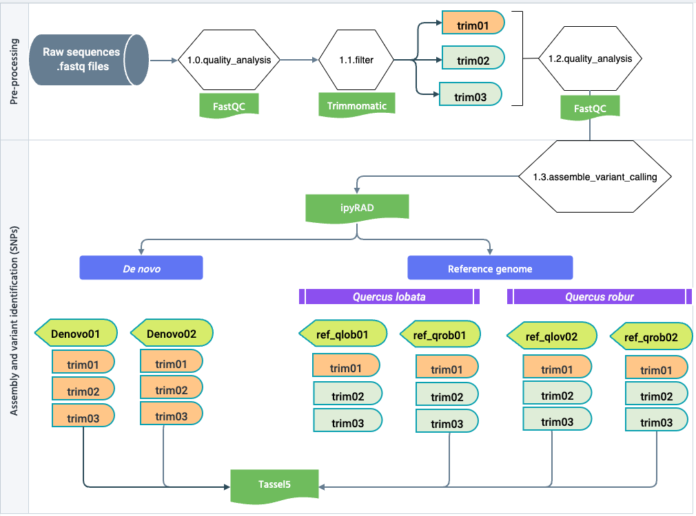

# Assembly, variant calling, and SNP filtering with ipyrad and TASSEL

This directory contains the VCF files generated from alternative ipyrad
assemblies and the corresponding post-assembly filtered datasets evaluated
during selection of the final SNP panel for downstream analyses.



## Assembly strategies

Three trimmed-read datasets were evaluated:

- `trim01`
- `trim02`
- `trim03`

Each dataset was assembled using the following strategies:

- *de novo* assembly;
- reference-based assembly using the *Quercus lobata* genome;
- reference-based assembly using the *Quercus robur* genome.

Two alternative ipyrad parameter sets were evaluated for each combination
of trimming dataset and assembly strategy.

### Parameter set 1

```python
("clust_threshold", "0.70")
("pop_assign_file", "popmap_9sites_2zones_trim01.txt")
```

### Parameter set 2

```python
("min_samples_locus", 79)
("clust_threshold", "0.90")
```

The `clust_threshold` parameter defines the minimum sequence-similarity
threshold used to identify homologous reads and cluster them into loci.
A value of `0.90`, for example, requires at least 90% sequence similarity.

Very high clustering thresholds may prevent homologous reads from being
grouped because of sequencing errors, polymorphisms, ambiguous bases, or
insertions and deletions.

The `min_samples_locus` parameter specifies the minimum number of samples
that must contain data at a locus for that locus to be retained in the
final dataset. In the first parameter set, sample-retention criteria were
instead supplied through the population-assignment file.

## Post-assembly VCF filtering

VCF files generated by ipyrad were subsequently filtered using
TASSEL v5.2.95 through:

> Filter > Filter Genotype Table Sites

The following settings were applied:

- Site Minimum Count: 79
- Site Minimum Allele Frequency: 0.00
- Site Maximum Allele Frequency: 1.00
- Remove Minor SNP States
- Remove Sites With Indels

The table below reports the number of SNPs obtained directly from ipyrad,
after the first filtering step, and after the second and final filtering
step.

## SNP counts across assembly strategies

| No. | Assembly strategy | Input | ipyrad run | Before filtering | After first filter | Final filtered SNPs |
|---:|---|---|---|---:|---:|---:|
| 1 | *De novo* | `trim01` | **`denovo_trim01_1`** | 4,087 | 3,471 | **3,429** |
| 2 | *De novo* | `trim02` | `denovo_trim02_1` | 986 | 638 | 628 |
| 3 | *De novo* | `trim03` | `denovo_trim03_1` | 3,582 | 3,002 | 2,965 |
| 4 | *De novo* | `trim01` | `denovo_trim01_2` | 4,087 | 3,471 | 3,429 |
| 5 | *De novo* | `trim02` | `denovo_trim02_2` | 986 | 638 | 628 |
| 6 | *De novo* | `trim03` | `denovo_trim03_2` | 3,582 | 3,002 | 2,965 |
| 7 | Reference: *Q. lobata* | `trim01` | **`ref_gen_qlob_trim01_1`** | 7,559 | 5,488 | **5,415** |
| 8 | Reference: *Q. lobata* | `trim02` | `ref_gen_qlob_trim02_1` | 1,946 | 1,094 | 1,076 |
| 9 | Reference: *Q. lobata* | `trim03` | `ref_gen_qlob_trim03_1` | 5,487 | 4,435 | 4,374 |
| 10 | Reference: *Q. lobata* | `trim01` | `ref_gen_qlob_trim01_2` | 7,559 | 5,488 | 5,415 |
| 11 | Reference: *Q. lobata* | `trim02` | `ref_gen_qlob_trim02_2` | 1,946 | 1,094 | 1,076 |
| 12 | Reference: *Q. lobata* | `trim03` | `ref_gen_qlob_trim03_2` | 5,487 | 4,435 | 4,374 |
| 13 | Reference: *Q. robur* | `trim01` | **`ref_gen_qrob_trim01_1`** | 7,611 | 5,501 | **5,426** |
| 14 | Reference: *Q. robur* | `trim02` | `ref_gen_qrob_trim02_1` | 1,815 | 1,048 | 1,027 |
| 15 | Reference: *Q. robur* | `trim03` | `ref_gen_qrob_trim03_1` | 5,382 | 4,291 | 4,230 |
| 16 | Reference: *Q. robur* | `trim01` | `ref_gen_qrob_trim01_2` | 7,611 | 5,501 | 5,426 |
| 17 | Reference: *Q. robur* | `trim02` | `ref_gen_qrob_trim02_2` | 1,815 | 1,048 | 1,027 |
| 18 | Reference: *Q. robur* | `trim03` | `ref_gen_qrob_trim03_2` | 5,382 | 4,291 | 4,230 |

## Final SNP dataset

The `trim01` datasets produced the largest numbers of retained SNPs under
all three assembly strategies. The reference-based assembly using the
*Quercus robur* genome produced the largest final dataset and was selected
for downstream analyses.

The final VCF used in the genetic diversity, population structure,
demographic history, and outlier analyses was:

`ref_gen_qrob_trim01_1_sorted.vcf`

This dataset contained:

- 7,611 SNPs in the original ipyrad VCF;
- 5,501 SNPs after the first TASSEL filtering step;
- 5,426 SNPs after the final filtering step.

The `_sorted.vcf` suffix identifies the post-filtered and sorted VCF used
as the common input for downstream analyses.

