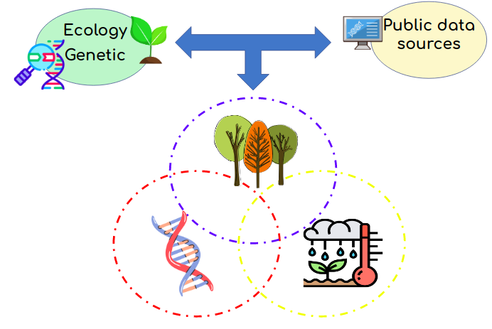
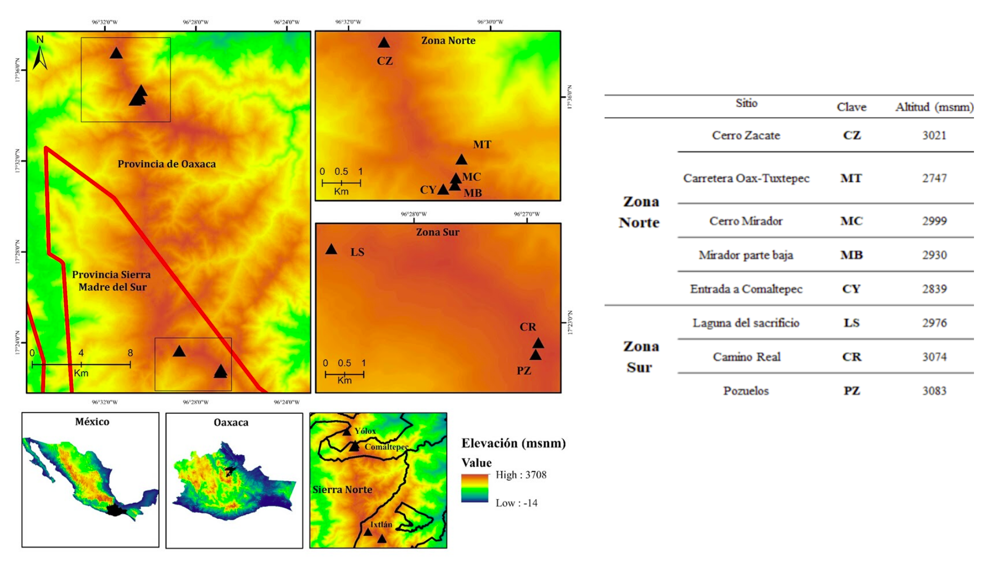
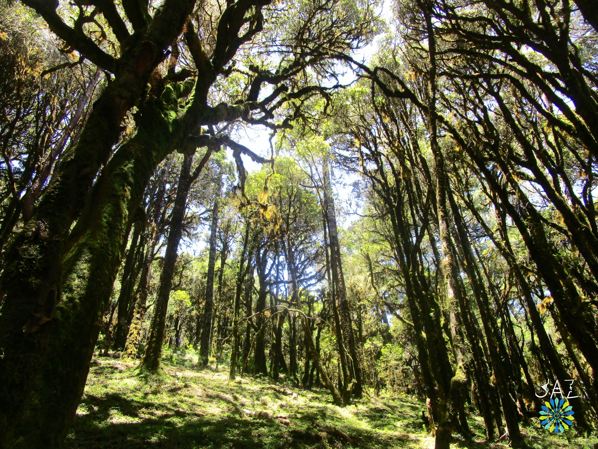

# First insights into the population genomics of _Quercus macdougallii_, an endemic oak of Mexico*

### Temperate forests

Temperate forests are important **reservoirs of biomass and biodiversity**, in addition to **providing ecological services** and being an indisputable part of the **biocultural heritage** of humankind [(Gil-Pelegrín *et al.,* 2017)](https://link.springer.com/book/10.1007%2F978-3-319-69099-5).

### Oaks

The *Quercus* genus, also known as oaks, is one of the most important groups in the forest ecosystems of the northern hemisphere [(Cavender-Bares, 2016)](https://www.cbs.umn.edu/sites/cbs.umn.edu/files/public/downloads/2016.cavender.journal.ios%2327.pdf). Currently, Mexico is the main center of diversification of the *Quercus* genus (approx. 150 spp.), of which about half (76 spp.) are endemic to the country ([Valencia, 2004](https://www.botanicalsciences.com.mx/index.php/botanicalSciences/article/view/1692); [Romero-Rangel *et al.,* 2015](https://www.internationaloaksociety.org/content/encinos-de-mexico-new-book-about-mexican-oaks-spanish-0)).

|     |     |
| -- | -- | 
|| From the work of [Denk *et al.,* 2017. An Updated Infrageneric Classification of the Oaks: Review of Previous Taxonomic Schemes and Synthesis of Evolutionary Patterns](https://link.springer.com/chapter/10.1007/978-3-319-69099-5_2) | 

This great diversity and endemism represent an important area of opportunity for studies of adaptation in long-lived tree species to environmental variables in the face of climate change, especially since their ability to face rapid environmental changes can indicate functional processes essential for their survival, being an ideal setting for functional genomics studies ([IPCC](https://www.ipcc.ch/); [Naidoo *et al.,* 2019](https://www.frontiersin.org/articles/10.3389/fpls.2019.00273/full)).

### *Quercus macdougallii*

The oak *Quercus macdougallii* Martínez (1963), also known as *Yaa dua yu* (Zapoteco) and *’Ma kue* (Chinanteco) is an **endangered** ([IUCN, 2020](https://www.iucnredlist.org/species/32765/2823034)) and **threatened** ([DOF, 2019](http://www.dof.gob.mx/nota_detalle.php?codigo=5578808&fecha=14/11/2019)) **endemic** species, which has a distribution restricted to the Sierra Juárez also known as Sierra Norte de Oaxaca ([Valencia, 2004](https://www.botanicalsciences.com.mx/index.php/botanicalSciences/article/view/1692); [Romero-Rangel *et al.,* 2015](https://www.internationaloaksociety.org/content/encinos-de-mexico-new-book-about-mexican-oaks-spanish-0)), and whose populations they maintain a binomial distribution with altitudinal selection ([Anacleto-Carmona, 2015](http://www.unsij.edu.mx/tesis/)).

Some studies have reported that at an ecological level this species has a low population number and survival problems, in addition its populations face events of anthropic disturbance (*i.e.*, deforestation and land-use change) and natural (fires and frosts) ([Anacleto-Carmona, 2015](http://www.unsij.edu.mx/tesis/); [Pariona *et al.,* 2017](https://www.sciencedirect.com/science/article/abs/pii/S0048969716320575); [Clark-Tapia *et al.,* 2018](http://www.scielo.org.mx/scielo.php?script=sci_arttext&pid=S1405-04712018000200217)). At genetic level, a low variation has been reported through the analysis of three nuclear microsatellites, possibly due to a bottleneck effect (Molina-Garay, 2011).

Recently, genomic variation has been analyzed from 8,186 *SNPs* (**single nucleotide polymorphisms**, [more information](https://www.youtube.com/watch?v=OOUkLiYrKEo)) and the current and future potential distribution under climate change scenarios for *Q. macdougallii* along its known distribution in the municipalities Ixtlán de Juárez , Santiago Comaltepec and San Pedro Yolox, identifying a possible genetic group with incipient structuring, as well as *outliers SNPs* (**_SNPs_ with high differentiation values**) associated with the area located in Ixtlán, which the future distribution model suggests will face drastic changes in its environmental conditions in the next 30 and 50 years ([Pacheco-Cruz, 2019](http://oreon.dgbiblio.unam.mx/F/X3YHJ1BNV7S4YYHEPDPIIA1S4GF2I5UGQMS61QGRFB4AHKPCJ7-04791?func=full-set-set&set_number=023823&set_entry=000002&format=999)).

 

## Hypothesis

- In long-lived tree species, genes associated with an adaptive response to climatic changes have been reported, therefore, it is expected that *Q. macdougallii*, an endemic oak, will present genes associated with environmental variables, such as temperature, precipitation and soil.

## Objectives

## Materials and methods

The study area is located in the Sierra Juárez de Oaxaca, in three municipalities, San Pedro Yolox, Santiago Comaltepec, and Ixtlán de Juárez. Considering eight sampling sites in its known distribution (approximately 28 km), five sites in the northern zone, and three in the southern zone.

In the work of [Pacheco-Cruz (2019)](http://oreon.dgbiblio.unam.mx/F/X3YHJ1BNV7S4YYHEPDPIIA1S4GF2I5UGQMS61QGRFB4AHKPCJ7-04791?func=full-set-set&set_number=023823&set_entry=000002&format=999), the genomic variation at the population level and the potential distribution of the species were analyzed considering these same sampling sites and 80 individuals collected. From the massive sequencing based on the **Sequence-based genotyping** (SBG, [for more information](https://www.youtube.com/watch?v=CpcM45HpcMU)) method, 700,000 readings were obtained per individual.

|     |     |
| -- | -- |
|| |
|From the work of [Pacheco-Cruz, 2019. Genomic variation and potential distribution of *Quercus macdougallii* Martínez, a species endemic to Oaxaca](http://oreon.dgbiblio.unam.mx/F/X3YHJ1BNV7S4YYHEPDPIIA1S4GF2I5UGQMS61QGRFB4AHKPCJ7-04791?func=full-set-set&set_number=023823&set_entry=000002&format=999)| |

The following analyzes will be carried out from this massive sequencing data set as well as the georeferencing data of each of its individuals collected.
|     | 
| -- | 
||
| |

From the sequencing data set [Pacheco-Cruz (2019)](http://oreon.dgbiblio.unam.mx/F/X3YHJ1BNV7S4YYHEPDPIIA1S4GF2I5UGQMS61QGRFB4AHKPCJ7-04791?func=full-set-set&set_number=023823&set_entry=000002&format=999), *outliers SNPs* will be identified between the two distribution zones of *Q. macdougallii*, north and south, by using bioinformatics programs such as [Stacks](https://catchenlab.life.illinois.edu/stacks/), [FreeBayes](https://bioinformaticsworkbook.org/dataAnalysis/VariantCalling/freebayes-dnaseq-workflow.html#gsc.tab=0), [Bayescan](http://cmpg.unibe.ch/software/BayeScan/) and the packages of [adegenet](http://adegenet.r-forge.r-project.org/files/tutorial-basics.pdf) and [snpstats](https://www.bioconductor.org/packages/release/bioc/html/snpStats.html) in R ([Caldu-Primo *et al.,* 2017](https://datadryad.org/stash/dataset/doi:10.5061/dryad.j2n8q); [Martins *et al.,* 2018](https://datadryad.org/stash/dataset/doi:10.5061/dryad.b56tm0t); [Pina-Martins *et al.,* 2019](https://onlinelibrary.wiley.com/doi/abs/10.1111/gcb.14497)).

## Relevance and impact of the project

This work will constitute the first step to study the genomics in natural populations of a Mexico endemic oak. This could help to detect geographic patterns of functional genomic variation and improve conservation plans for the species. In addition, for the area of ecology and evolutionary biology, this project is an opportunity to identify evolutionary processes that could be affecting the genomic variation of this endemic species and its local adaptation, which can serve as a reference for future studies of oaks endemic to Oaxaca and Mexico, given its importance as the second forest group in Mexico and as an axis group of the temperate forests of the country.

This project is close to what goal 15 of [The Sustainable Development Goals (SDG)](https://www.un.org/sustainabledevelopment/es/) proposed by the United Nations (UN).
Because the information generated in this project is expected to help in the management of forests in a sustainable way and stop the loss of biodiversity that can occur due to lack of information on key species in the functioning of ecosystems.

Also, given that this oak is located in an area where indigenous communities try to conserve the biodiversity of their forests and at the same time maintain sustainable forest management, it is important to promote multidisciplinary projects in order to increase the capacity for planning and effective management in relation to the management and conservation plans in the face of climate change, as proposed in Goal 13.b of the SDG.

